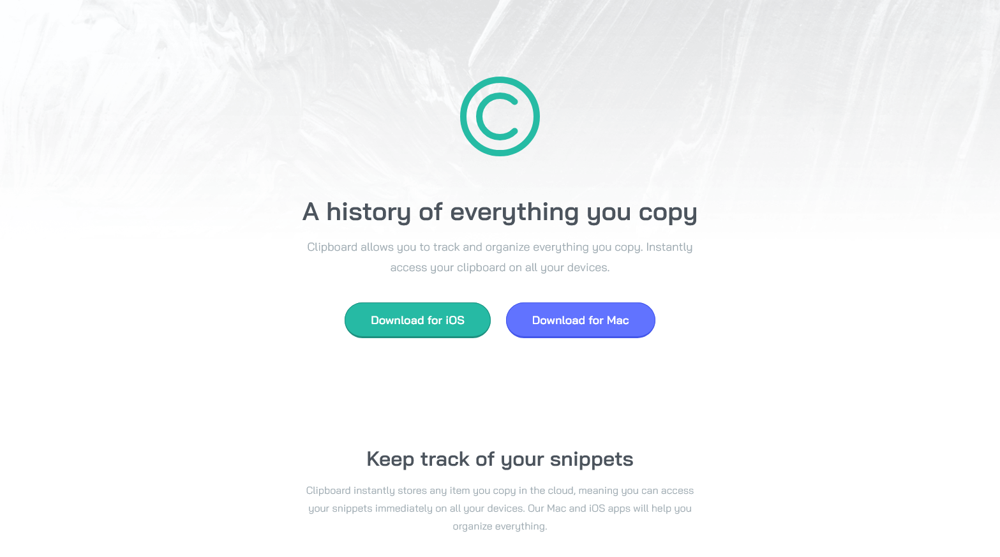

# Frontend Mentor - Clipboard landing page solution

This is a solution to the [Clipboard landing page challenge on Frontend Mentor](https://www.frontendmentor.io/challenges/clipboard-landing-page-5cc9bccd6c4c91111378ecb9). Frontend Mentor challenges help you improve your coding skills by building realistic projects. 

## Table of contents

- [Overview](#overview)
  - [The challenge](#the-challenge)
  - [Screenshot](#screenshot)
  - [Links](#links)
- [My process](#my-process)
  - [Built with](#built-with)
  - [What I learned](#what-i-learned)
  - [Continued development](#continued-development)
- [Author](#author)

**Note: Delete this note and update the table of contents based on what sections you keep.**

## Overview

### The challenge

Users should be able to:

- View the optimal layout for the site depending on their device's screen size
- See hover states for all interactive elements on the page

### Screenshot



### Links

- [Solution URL](https://github.com/lucarl07/clipboard-landing-page)
- [Live Site URL](https://lucarl07.github.io/clipboard-landing-page/)

## My process

### Built with

- Semantic HTML5 markup
- CSS custom properties & nesting
- CSS Grid & Flexbox
- Mobile-first workflow

**Note: These are just examples. Delete this note and replace the list above with your own choices**

### What I learned

- **Difference between `<article>` & `<section>`:** During this challenge, the difference between the usages of the `<section>` and `<article>` tags became clearer to me, and it made me realise that, in the context of a landing page, the better alternative was to separate main page segments and information blocks with `<section>` tags only.

```html
<section class="tracking-snippets">
  <section class="wrapper-start text-medium">
    <h2>Keep track of your snippets</h2>
    <p>
      Clipboard instantly stores any item you copy in the cloud, 
      meaning you can access your snippets immediately on all your 
      devices. Our Mac and iOS apps will help you organize everything.
    </p>
  </section>
  <!-- ... -->
</section>
```

- **Using the `:not()` selector:** When I started writing the HTML, I was unsure if I should display the attribution footer below the challenge's own footer - thus showing them separately - or simply deleting the former. Due to this, I decided to keep the attribution footer in the source code but style the footers separately, and while I recognize I could assign an unique class to each one, I opted to keep only the .attribution class and use the `:not()` selector to grab the first footer.

```css
footer:not(.attribution) {
  /* ... */
}
```

- **Using CSS's relative color syntax:** For a long time I was completely unaware of this syntax, but it helped a lot in using colors derived from custom variables, without having to manually paste and modify the variables' values (which would be simpler, but less explicit regarding the origin of the specific color). In the example below, the first element inside a .btn-wrapper parent has a border color similar to its background color, only with less luminosity.

```css
.btn-wrapper {
  /* ... */
  :nth-child(1) {
    background-color: var(--color-strong-green);
    border-color: hsl(from var(--color-strong-green) h s calc(l - 10));
  }
  /* ... */
}
```

### Continued development

I'm rather satisfied with my skills using vanilla HTML and CSS, and now I pretend to go back to challenges which involve JavaScript, using the Vue framework as an auxiliary tool.

## Author

- GitHub - [lucarl07](https://lucarl07.github.io)
- Frontend Mentor - [@lucarl07](https://www.frontendmentor.io/profile/lucarl07)
